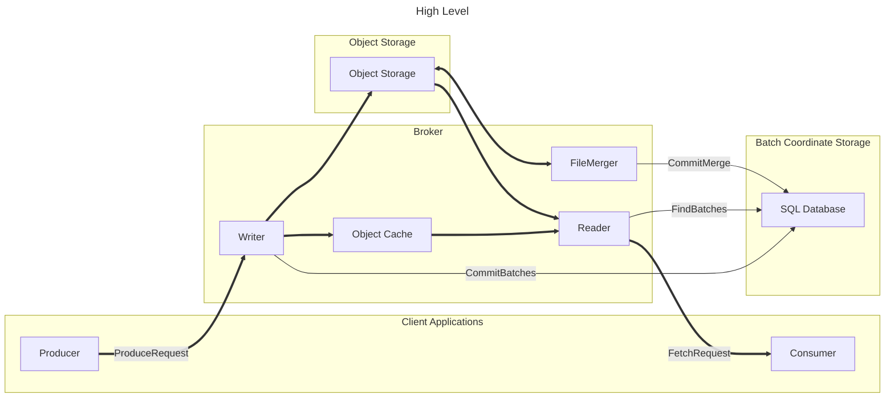
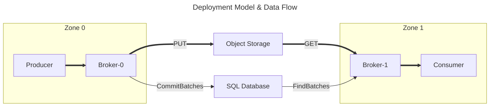
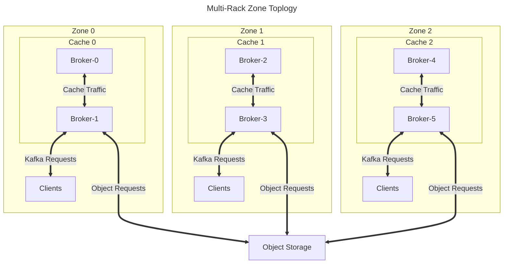
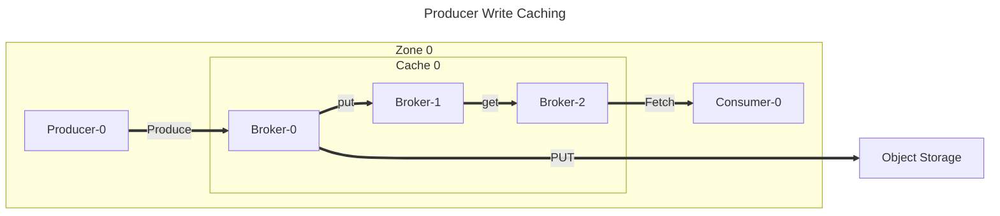
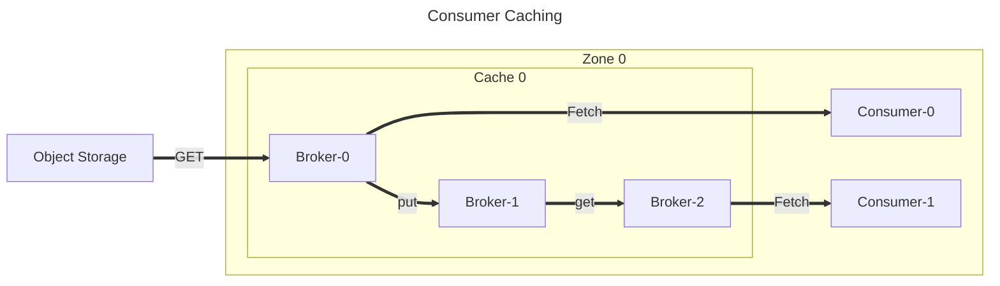

# Inkless Architecture

Data from ProduceRequests is written to object storage without assigning offsets.
Multiple ProduceRequests from multiple clients may be combined together into a single object to reduce the number of object writes.
The batch metadata (topic, partition, etc.) and location of the data (object ID & extent) are sent to a SQL database to be committed in a linear order.
The data is opportunistically cached by the writer.

Consumer FetchRequests are served by querying the SQL database to find upcoming batch metadata for the requested partitions. 
Data is first queried from the Object Cache, and will be returned if it was requested recently by another Consumer.
If the cache misses, the object is read from object storage and then populated in the cache.
Offsets for the returned data are inserted from the batch metadata. 

A background job in the brokers processes recently added objects, and merges multiple objects together into larger objects.
This improves the locality of data in each partition and reduces read amplification caused when multiple partitions are stored together.

# Deployment Model & Data Flow

Inkless is designed to be deployed in a non-uniform network environment, where there is a cost incentive for keeping data transfers local.
A single cluster which is deployed in multiple zones may produce in one zone and consume in another, while:

* Preserving global order consistency
* Durably storing data and metadata
* Avoiding cross-zone data transfers
* Serving multiple consumers at a low marginal cost

# Caching

A single cluster may have a single cache if `broker.rack` is unset.
If `broker.rack` is set, brokers will join rack-specific caches, which are intended to align with network zones.
Brokers each contain an embedded distributed cache, and brokers become members of this cache in their local rack.
Each rack independently serves Kafka requests, and makes Object requests. Cached data is not shared between racks.

Data written by producers to object storage is also written to the cache.
Consumers in the local zone may fetch from this cache without requiring reading the object from storage.

When object data is necessary to serve a request, the data is preferentially served from the rack's cache.
If a cache miss occurs (Consumer-0) data is fetched from the object storage.
After the cache miss, the data is populated in the cache in one member in the rack.
If a cache hit occurs (Consumer-1), the data is loaded remotely from another member of the cache.