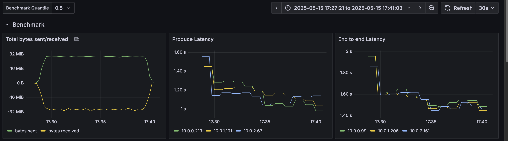
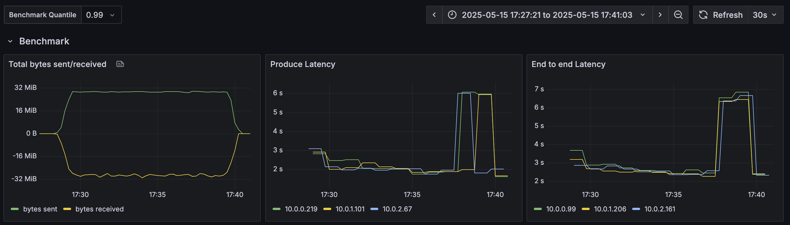
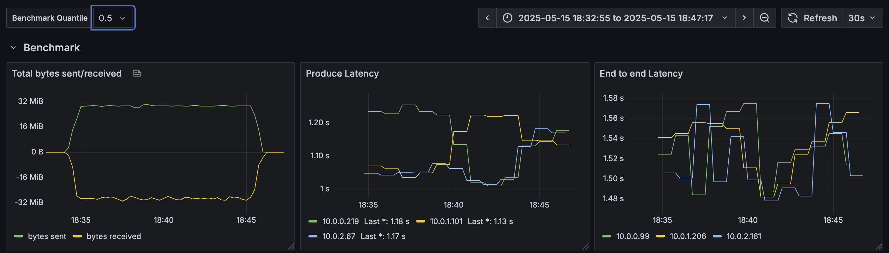
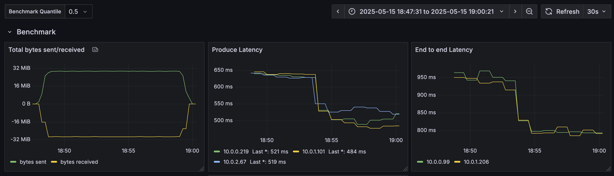
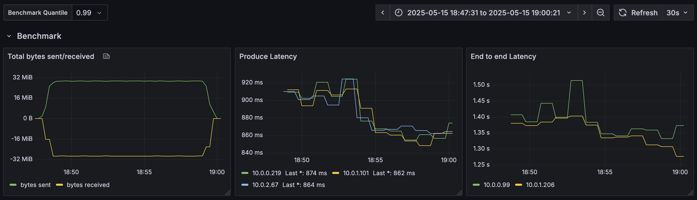
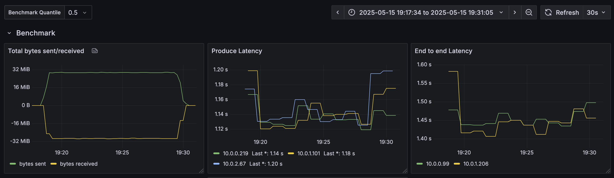
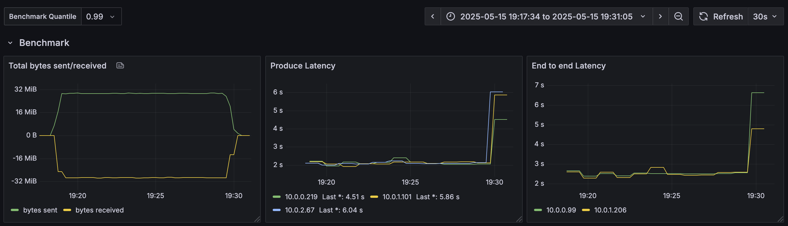

# Inkless Performance Tuning guide

## Write path

Before sending data to the Inkless topic, the producer will request topic metadata from the Kafka broker.
Given that Inkless topics are not replicated, and have no leaders, the metadata will return any broker in the cluster;
or find brokers within the same availability zone (AZ) if the client has included the AZ within the `client.id` property
following the pattern `client.id=...inkless_az=<AZ>`. 

When writing to Diskless topics, the following stages are involved when a Produce request is received:

- Appending and Rotating the Write Ahead Log Segment
- Upload Files to Remote Storage
- Commiting Batches to Batch Coordinator
- Returning Produce Response

Rotating the WAL segment is bound by the `inkless.produce.commit.interval.ms` configuration (default 250ms),
and `inkless.produce.buffer.max.bytes` (default 8MiB).

Once a WAL segment is rotated, upload to remote storage is triggered.
e.g. for AWS S3 the upload latency depends on the segment size, with observed P99 latencies of 200-400ms for 2-8MB segments.

Committing batches to the Batch Coordinator depends on the batches per commit, and observed P99 latences for the PG implementation are around ~50ms.

For brokers to saturate the rotation and trigger faster uploads to increase throughput, concurrent producer requests are needed.
At the moment, this can only be achieved by using multiple producers, as the current implementation of the Kafka producer does not support concurrent requests from the same producer.
To cope with this at the producer side, batching has to be tuned to align with the Inkless pipeline latencies.

The following configuration is recommended for the producer:

```properties
linger.ms=100  # or higher depending on the concurrency of the producers
batch.size=1000000
```

Having low concurrency (e.g. 1 producer per AZ) will lead to higher latencies, as the producer will wait for the linger.ms time before sending the request;
and a single request per producer will be processed by the broker at a time.

For instance, the following latencies could be observed with a single producer per AZ with the following configuration:

```properties
  retries=2147483647
  linger.ms=1
  batch.size=1000000
  buffer.memory=128000000
  max.request.size=64000000
```





When increasing linger to 100ms, the latencies are not changed much as only 1 producer is active per broker:





Only when increasing the numer of producers, e.g. 10 per AZ, the latencies are reduced significantly:

```properties
  retries=2147483647
  linger.ms=500
  batch.size=1000000
  buffer.memory=128000000
  max.request.size=64000000
```




Reducing the linger back to 50 ms shows the impact on latency:




> [!NOTE]
> It is still early days for the Inkless implementation, and the performance numbers are only examples of how the tuning parameters and concurrency affect latency. 
> Improvements are under active research and development.

## Read path

When reading from Diskless topics, the following stages are involved when a Fetch request is received:

- Find the batches coordinates
- Plan the fetching strategy
- Fetch object ranges from remote storage
- Prepare Fetch response assigning offsets to the batches

During the initial find and planning stages, the broker will fetch the batch coordinates from the Batch Coordinator.
The observed P99 latencies for this stage are around ~10ms.
Fetching the objects from remote storage depends on the object size and the number of objects to fetch.
For instance, for AWS S3, the latencies are around 100-200ms for 2-8MB objects.


