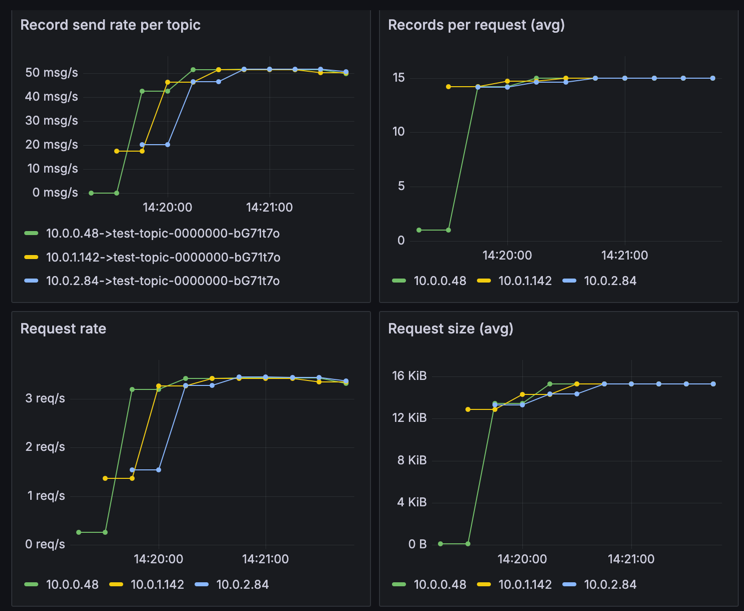
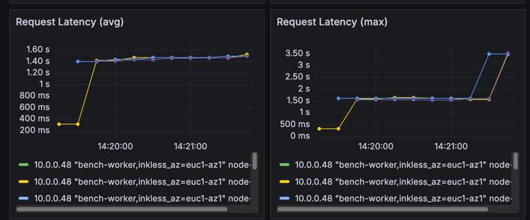
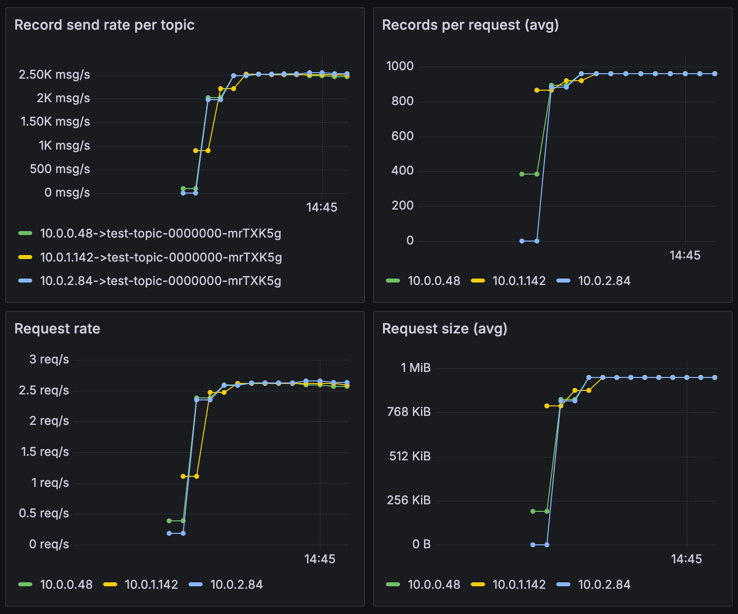
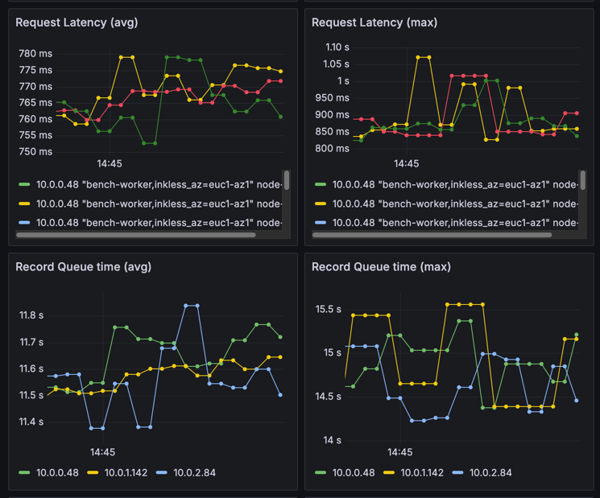
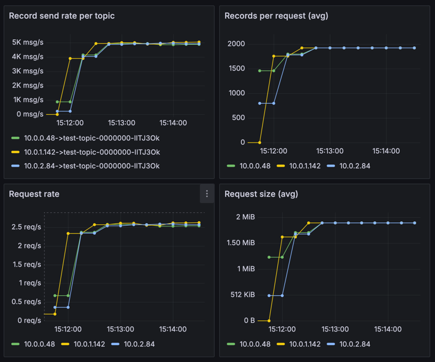
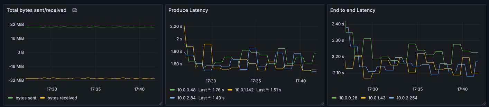
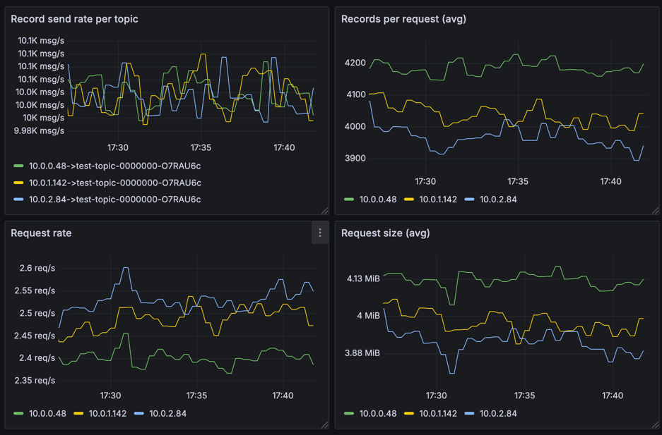
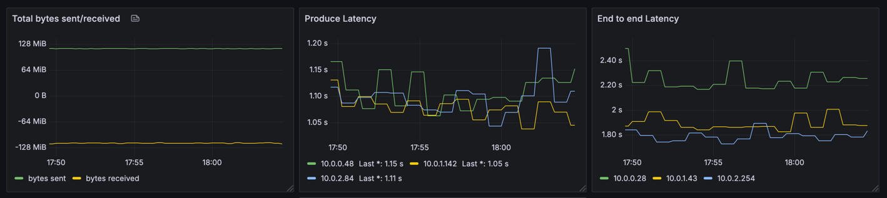

# Inkless Performance Tuning guide

## Write path

Before sending data to the Inkless topic, the producer will request topic metadata from the Kafka broker.
Given that Inkless topics are not replicated, and have no leaders, the metadata will return any broker in the cluster;
or find brokers within the same availability zone (AZ) if the client has included the AZ within the `client.id` property
following the pattern `client.id=...,inkless_az=<AZ>`. 

When writing to Diskless topics, the following stages are involved when a Produce request is received:

- Appending and Rotating the Write Ahead Log Segment
- Upload Files to Remote Storage
- Commiting Batches to Batch Coordinator
- Returning Produce Response

Rotating the WAL segment is bound by the `inkless.produce.commit.interval.ms` configuration (default 250ms),
and `inkless.produce.buffer.max.bytes` (default 8MiB).

Once a WAL segment is rotated, upload to remote storage is triggered.
e.g. for AWS S3 the upload latency depends on the segment size, with observed P99 latencies of 200-400ms for 2-8MB segments.

Committing batches to the Batch Coordinator depends on the batches per commit, and observed P99 latences for the PG implementation are around ~10-20ms.

For brokers to saturate the rotation and trigger faster uploads to increase throughput, concurrent producer requests are needed.
At the moment, this can only be achieved by using multiple producers and partitions, 
as the current implementation of the Kafka producer does not support concurrent requests from the same producer,
and a single request size is limited to the number of partitions: # partitions * max.message.size (1MiB default).

> [!IMPORTANT]
> When starting a single produce (e.g. kafka-producer-perf-test.sh) client, the producer will only send a single request at a time.
> Without any tuning, the producer will be able to create up to 1MiB request (default `max.request.size`) per request.
> and it will depend on how many partitions are available to the producer to get to that size
> based on the batch.size: batch.size * partitions = request size.
> 
> Considering the latencies of the Inkless pipeline, the throuhgput will be bound to 4 request per second
> as the WAL buffer is not saturated and will rotate every 250ms (default `inkless.produce.commit.interval.ms`).

To cope with this at the producer side, batching has to be tuned to align with the Inkless pipeline latencies.

The following configuration is recommended for the producer:

```properties
linger.ms=100  # or higher depending on the concurrency of the producers
batch.size=1000000
max.request.size=8000000
```

In this case, with 8 partitions to write to, the producer will be able to send up to 8MiB per request.

> [!NOTE]
> At the moment the Inkless implementation is sending all batches from the same request on the same WAL multi segment file.
> This means that if the request is larger than the `inkless.produce.buffer.max.bytes` (default 8MiB),
> then the upload latencies will be higher as the files are larger.
> This has a penalty on the throughput, as the upload will take longer to complete, slowing down commits.
> We have plans to improve this in the future by splitting the request into multiple WAL segments,
> but this is not yet implemented.

Having low concurrency (e.g. 1 producer per AZ) could lead to higher latencies, 
as the producer will wait for the linger.ms time before sending the request;
and a single request per producer will be processed by the broker at a time.

With default settings, a single producer, writing to a single partition will have a very low throughput and high latencies, 
as it will only be able to send a single request at a time:

```yaml
topics: 1
partitionsPerTopic: 1

# 10MiB per producer
producerRate: 30000
messageSize: 1024
producersPerTopic: 3

subscriptionsPerTopic: 1
consumerPerSubscription: 12
```

The producer will be bound to a maximum request size of 1 batch (16KiB by default) per request, 
with a request rate of 4 requests per second in average:



And the latencies will pile up trying to achieve the requested throughput of 10MiB:



> [!NOTE]
> These graphs show 3 producers (one per AZ) writing to a cluster of 3 brokers (one per AZ as well),
> which effectively means a single producer per broker.

So, unless your throughput is _very_ low, you will need to increase the number of partitions, 
and producer concurrency to achieve the desired throughput and latencies.

> [!IMPORTANT]
> If this is the case, very small files will be created in the remote storage,
> leading to a larger number of request to consume; increasing the overall cost (in some cases even higher than local storage).
> So, if this is your use-case, stick with local storage.
> Only when throughput per broker can be maintained > 1MiB/s,
> the Inkless implementation will be able to provide a better cost per request than local storage.

### Increasing number of partitions

For instance, let's increase the number of partitions to 64.
This should allow the produce to increase the request size to the maximum of 1MiB (default `max.request.size`):



This will increase the throughput to ~2-3 MiB/s per producer, as the request size is larger.



But the latencies are still high: the request latency is ~1sec, but the waiting time is ~16sec. Not good.
This is caused by the producer being too eager to produce (i.e. no linger time).

So, we could increase the batching to get to larger and more stable throughput.

### Tuning the producer batching

To achieve the initial goal of 10MiB/s, and a default request size of 1MiB is giving us ~2-3MiB/s per producer,
we would need to increase the linger time, to avoid piling up requests and waiting for the next request to be processed,
and increase the request size, to allow for producers to create larger requests.

Let's double the request size to 2MiB, double the batch size, and increase the linger time to 50ms:

```properties
  linger.ms=100
  batch.size=32000
  max.request.size=2000000
```

This will increase the throughput to ~5 MiB/s per producer, and the request size to 2MiB.



A producer can be pushed to higher throughput by increasing the batch size to its maximum (1MiB),
and increasing the request size to 8MiB, which will allow the producer to create larger requests:

```properties
  linger.ms=100
  batch.size=1000000
  max.request.size=8000000
```

The 30MiB/s goal can then be achieved with 3 producers per AZ, but the max request size is not saturated yet:





### Increasing produce concurrency

A single produce can do so much, so we need to increase the number of producers to achieve higher throughput.

For instance, to achieve 120MiB/s, we can increase the number of producers to 4 per AZ:



Even with lower produce latency as there are more producers writing to the same broker, rotating files faster, and uploading more data concurrently.

> [!NOTE]
> It is still early days for the Inkless implementation, and the performance numbers are only examples of how the tuning parameters and concurrency affect latency. 
> Improvements are under active research and development.

## Read path

When reading from Diskless topics, the following stages are involved when a Fetch request is received:

- Find the batches coordinates
- Plan the fetching strategy
- Fetch object ranges from remote storage
- Prepare Fetch response assigning offsets to the batches

During the initial find and planning stages, the broker will fetch the batch coordinates from the Batch Coordinator.
The observed P99 latencies for this stage are around ~10ms.
Fetching the objects from remote storage depends on the object size and the number of objects to fetch.
For instance, for AWS S3, the latencies are around 100-200ms for 2-8MB objects.
